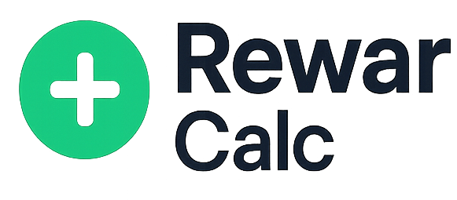

# � RewarCalc - Calculadora de Pontos Xbox

<div align="center">
  
  
  <p><strong>Descubra o valor real dos seus pontos Xbox Rewards</strong></p>
  <p>Calcule instantaneamente quanto valem seus pontos e encontre as melhores recompensas para trocar</p>
  
  <p><em>⚠️ Projeto independente, não afiliado à Microsoft ou Xbox</em></p>
</div>

<p align="center">
    
    
    
    
    
</p>

## 🚀 Sobre o Projeto

A **RewarCalc** é uma ferramenta independente desenvolvida para gamers que participam do programa Xbox Rewards. Esta aplicação web moderna ajuda você a:

-   💰 **Calcular o valor real** dos seus pontos Xbox Rewards
-   🛍️ **Descobrir as melhores trocas** disponíveis no catálogo
-   📊 **Comparar recompensas** e encontrar o melhor custo-benefício
-   ⏱️ **Economizar tempo** sem precisar navegar pelo app oficial

> **Nota importante**: Este é um projeto independente criado por e para a comunidade gamer. Não possui qualquer vínculo oficial com a Microsoft, Xbox ou o programa Xbox Rewards.

### ✨ Funcionalidades

-   🎯 **Calculadora de Pontos Xbox** - Conversão precisa de pontos para valores em reais
-   🛒 **Catálogo de Recompensas** - Lista atualizada com gift cards, jogos e DLCs
-   💳 **Gift Cards Populares** - Xbox Gift Card, Steam, PlayStation, Nintendo eShop
-   🎮 **Jogos e Conteúdo** - Game Pass, jogos AAA, expansões e season passes
-   📊 **Comparador de Ofertas** - Encontre as trocas com melhor custo-benefício
-   🔍 **Busca Inteligente** - Filtre por categoria, valor ou pontos necessários
-   🌙 **Modo Escuro/Claro** - Interface adaptável com tema automático
-   📱 **Design Responsivo** - Funciona perfeitamente em qualquer dispositivo
-   ⚡ **Cálculos Instantâneos** - Resultados em tempo real sem recarregar a página
-   🎨 **Interface Gamer** - Design moderno com efeitos neon e animações

### 🛠️ Tecnologias Utilizadas

-   **Backend**: Laravel 12
-   **Frontend**: Livewire 3 + Alpine.js
-   **Styling**: TailwindCSS 4 + TallStackUI
-   **Build**: Vite
-   **Database**: SQLite
-   **Testing**: Pest + PHPUnit

## 🎨 Interface

A aplicação possui um design inspirado no universo gamer com elementos futuristas:

-   ✨ **Linha neon animada** no topo com efeito pulsante
-   🔷 **Hexágono rotativo** com brilho dinâmico representando conquistas
-   💫 **Padrão de pontos** com fade suave simulando rewards coletados
-   🌌 **Background gradiente** que remete aos temas dark dos jogos
-   🔄 **Micro-animações** que tornam a experiência mais envolvente
-   🎯 **Calculadora centralizada** com foco na usabilidade
-   📊 **Visualização clara** dos resultados e comparações

### 🖼️ Screenshots

> _Em breve: capturas de tela da interface_

## 🚀 Instalação

### Pré-requisitos

-   PHP >= 8.2
-   Composer
-   Node.js >= 16
-   NPM ou Yarn

### Passos de Instalação

1. **Clone o repositório**

    ```bash
    git clone https://github.com/your-username/rewar-calc.git
    cd rewar-calc
    ```

2. **Instale as dependências PHP**

    ```bash
    composer install
    ```

3. **Instale as dependências Node.js**

    ```bash
    npm install
    ```

4. **Configure o ambiente**

    ```bash
    cp .env.example .env
    php artisan key:generate
    ```

5. **Configure o banco de dados**

    ```bash
    touch database/database.sqlite
    php artisan migrate --seed
    ```

6. **Compile os assets**

    ```bash
    npm run build
    # ou para desenvolvimento
    npm run dev
    ```

7. **Inicie o servidor**
    ```bash
    php artisan serve
    ```

## 🏃‍♂️ Desenvolvimento

Para desenvolvimento com hot-reload:

```bash
# Terminal 1 - Servidor Laravel
php artisan serve

# Terminal 2 - Vite (assets)
npm run dev

# Ou use o comando combinado
composer run dev
```

## 🧪 Testes

```bash
# Executar todos os testes
composer test

# Testes com cobertura
./vendor/bin/pest --coverage

# Análise estática
composer analyse

# Formatação de código
composer format
```

## 📁 Estrutura do Projeto

```
app/
├── Livewire/
│   ├── Calculator/     # Calculadora de pontos Xbox
│   │   └── Calculator.php
│   ├── Home/          # Página inicial e navegação
│   │   ├── Navbar.php
│   │   └── Footer.php
│   └── User/          # Sistema de usuários (opcional)
├── Models/            # Modelos para rewards e conversões
└── View/Components/   # Componentes reutilizáveis

resources/
├── css/
│   ├── app.css        # Estilos principais + TailwindCSS
│   └── background.css # Efeitos neon e animações
├── js/
│   └── app.js         # Interações + Alpine.js
└── views/
    └── livewire/      # Templates dos componentes
        ├── calculator/
        └── home/

database/
├── migrations/        # Estrutura do banco (rewards, conversões)
└── seeders/          # Dados iniciais das recompensas
```

## 🔧 Configuração

### Variáveis de Ambiente

```env
APP_NAME="RewarCalc"
APP_ENV=local
APP_DEBUG=true
APP_URL=http://localhost

DB_CONNECTION=sqlite
```

### Comandos Úteis

```bash
# Limpar cache
php artisan optimize:clear

# Recompilar assets
npm run build

# Executar migrações e popular com dados das recompensas
php artisan migrate:fresh --seed

# Atualizar catálogo de recompensas (futuro)
php artisan rewards:update
```

## 📈 Roadmap

### 🚧 Em Desenvolvimento

-   [ ] **Database de Recompensas** - Catálogo completo e atualizado
-   [ ] **Histórico de Conversões** - Acompanhe suas trocas
-   [ ] **Favoritos** - Salve as recompensas que mais interessam
-   [ ] **Notificações** - Alertas quando pontos suficientes para uma recompensa

### 🔮 Futuras Implementações

-   [ ] **API de Integração** - Conecte com sua conta Xbox (se possível)
-   [ ] **Comparador de Preços** - Compare com lojas oficiais
-   [ ] **Calculadora de Tempo** - Estime quanto tempo para juntar pontos
-   [ ] **Sistema de Ranking** - Melhores ofertas do mês
-   [ ] **PWA** - App instalável no celular

## 🤝 Contribuição

Contribuições são sempre bem-vindas! Este projeto é feito pela comunidade gamer para a comunidade gamer.

### 🎮 Como Contribuir

1. **Fork** o projeto
2. Crie uma **branch** para sua feature (`git checkout -b feature/nova-recompensa`)
3. **Commit** suas mudanças seguindo os padrões (`git commit -m 'feat: adiciona gift card Steam'`)
4. **Push** para a branch (`git push origin feature/nova-recompensa`)
5. Abra um **Pull Request** detalhado

### 💡 Tipos de Contribuição

-   🆕 **Novas recompensas** no catálogo
-   🐛 **Correções de bugs** ou cálculos
-   💅 **Melhorias na UI/UX**
-   📊 **Funcionalidades** para comparação
-   📝 **Documentação** e tutoriais
-   🧪 **Testes** automatizados

### 📝 Padrões de Commit

-   `feat:` Nova funcionalidade
-   `fix:` Correção de bug
-   `docs:` Documentação
-   `style:` Formatação
-   `refactor:` Refatoração
-   `test:` Testes

## 📄 Licença

Este projeto está sob a licença MIT. Veja o arquivo [LICENSE](LICENSE) para mais detalhes.

## 👨‍💻 Autor

**Vivian Pereira**

-   GitHub: [@vivian](https://github.com/vivian)
-   Email: vivian_pereira@outlook.com.br

## ⚖️ Disclaimer

Este projeto é **independente** e **não possui qualquer afiliação** com:

-   Microsoft Corporation
-   Xbox ou Xbox Game Studios
-   Programa Xbox Rewards
-   Qualquer marca ou produto mencionado

O RewarCalc é uma ferramenta **não-oficial** criada pela comunidade para ajudar gamers a entender melhor o valor de seus pontos. Todas as informações são baseadas em dados públicos e podem não refletir valores exatos ou atualizados.

## 🙏 Agradecimentos

-   🎮 **Comunidade Gamer** - Por inspirar este projeto
-   [Laravel](https://laravel.com) - Framework PHP robusto
-   [Livewire](https://laravel-livewire.com) - Componentes reativos
-   [TallStackUI](https://tallstackui.com) - Componentes UI modernos
-   [TailwindCSS](https://tailwindcss.com) - Framework CSS utilitário
-   🎨 **Animista.net** - Animações CSS incríveis

---

<div align="center">
  <p>Feito com ❤️ e ☕ por <strong>Vivian Pereira</strong></p>
  <p>🎮 <em>"Helping gamers maximize their rewards, one calculation at a time"</em></p>
  <p>© 2025 RewaCalc™ - Projeto Open Source</p>
</div>
